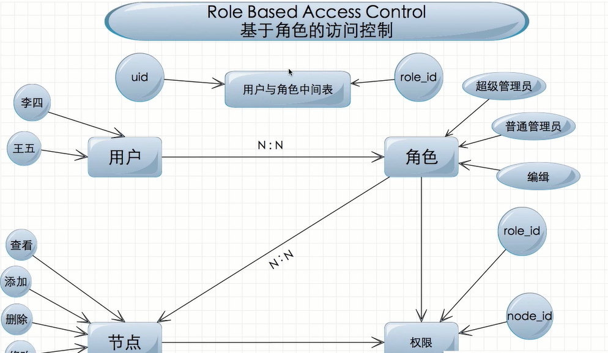

# PRJ06项目内容笔记
> 访问前台：[http://localhost:8888/TPBase/Base/prj05/](http://localhost:8888/TPBase/Base/prj05/)

> 访问后台：[http://localhost:8888/TPBase/Base/prj05/index.php/Admin]()

> 后台登入：[http://localhost:8888/TPBase/Base/prj05/index.php/Admin/Login]()

> 访问hadnle方法：[http://localhost:8888/TPBase/Base/prj05/Index.php/Index/Index/handle]()

## 一、主要内容

* RBAC概念
* 建立5张表
* 添加角色功能
* 添加节点
* node_merge()方法的理解
* explode()方法 in_array()方法 is_array()方法
* 操作数据库方法：addAll 插入多条数据，getField()只读取一个字段
* TP中的 if 标签
* jQuery 中的 clone()方法
* 建立模型：Model，以及实例化模型D()

## 二、知识点
> 1、RBAC概念
	
	Role Based Access Control (基于角色的访问控制)
	有5张表，用户表、角色表、权限表、节点表、用户与角色中间表
	其中：用户表与角色表是多对多的关系、角色于节点也是多对多的关系。
	用户与角色表：存储的是用户的id 和 角色的id
	权限表中：存储的是节点id与角色id

> 2、建立五张表
	
	用户表需要我们自己创建，其余四张表ThinkPHP中已经替我们写好了。
	我们找到ThinkPHP/Extend/Library/ORG/Util/RBAC.class.php
	里面有注释，替我们写好了创建语句。
	
	CREATE TABLE IF NOT EXISTS `hd_access` (
	  `role_id` smallint(6) unsigned NOT NULL,
	  `node_id` smallint(6) unsigned NOT NULL,
	  `level` tinyint(1) NOT NULL,
	  `module` varchar(50) DEFAULT NULL,
	  KEY `groupId` (`role_id`),
	  KEY `nodeId` (`node_id`)
	) ENGINE=MyISAM DEFAULT CHARSET=utf8;
	
	CREATE TABLE IF NOT EXISTS `hd_node` (
	  `id` smallint(6) unsigned NOT NULL AUTO_INCREMENT,
	  `name` varchar(20) NOT NULL,
	  `title` varchar(50) DEFAULT NULL,
	  `status` tinyint(1) DEFAULT '0',
	  `remark` varchar(255) DEFAULT NULL,
	  `sort` smallint(6) unsigned DEFAULT NULL,
	  `pid` smallint(6) unsigned NOT NULL,
	  `level` tinyint(1) unsigned NOT NULL,
	  PRIMARY KEY (`id`),
	  KEY `level` (`level`),
	  KEY `pid` (`pid`),
	  KEY `status` (`status`),
	  KEY `name` (`name`)
	) ENGINE=MyISAM  DEFAULT CHARSET=utf8;
	
	CREATE TABLE IF NOT EXISTS `hd_role` (
	  `id` smallint(6) unsigned NOT NULL AUTO_INCREMENT,
	  `name` varchar(20) NOT NULL,
	  `pid` smallint(6) DEFAULT NULL,
	  `status` tinyint(1) unsigned DEFAULT NULL,
	  `remark` varchar(255) DEFAULT NULL,
	  PRIMARY KEY (`id`),
	  KEY `pid` (`pid`),
	  KEY `status` (`status`)
	) ENGINE=MyISAM  DEFAULT CHARSET=utf8 ;
	
	CREATE TABLE IF NOT EXISTS `hd_role_user` (
	  `role_id` mediumint(9) unsigned DEFAULT NULL,
	  `user_id` char(32) DEFAULT NULL,
	  KEY `group_id` (`role_id`),
	  KEY `user_id` (`user_id`)
	) ENGINE=MyISAM DEFAULT CHARSET=utf8;

> 3、添加角色

		if (M('role')->add($_POST)){ //因为POST里面的表单参数跟数据库里的一样，所以我直接可以添加

> 4、添加节点

	在hd_node表中，有一个字段叫level
	level这个字段有3个值
	1：表示应用名称，前台或后台
	2：控制器名称
	3：控制器里面的方法

	pid字段：为指向其父亲的id
	
	
	TP中有三种模型，起名字的规定
	普通模型：User
	视图模型：UserView
	关联模型：UserRelation

	TP中的关联关系包括下面三种：
	一对一关联 ：HAS_ONE
	一对多关联 ：HAS_MANY
	多对多关联 ：MANY_TO_MANY
	